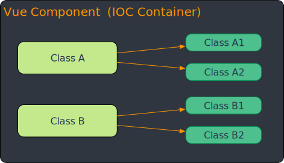

# 为什么需要Vue3+IOC

Vue3 已经非常强大和灵活了，为什么还要引入 IOC 容器呢？IOC 容器离不开 Class，那么我们就从 Class 谈起

## Class的应用场景

一提起 Class，大家一定会想到这是 Vue 官方不再推荐的代码范式。其实，更确切的说，Vue 官方是不推荐基于 Class 来定义 Vue 组件。如图所示：

社区确实有几款`基于Class定义组件`的方案，但实际应用效果不理想，所以不被 Vue 官方推荐。这些有价值的社区实践在不同阶段给 Vue 开发带来了便利，同时也恰恰说明一个道理：

::: info
Class 不应该用在`视图层`，而是要用到`业务层`
:::

- 以下是几款社区 Class 方案，供参考：
  - [vue-class-component](https://github.com/vuejs/vue-class-component)
  - [vue-facing-decorator](https://github.com/facing-dev/vue-facing-decorator)
  - [vue-property-decorator](https://github.com/kaorun343/vue-property-decorator)
  - [nuxt-property-decorator](https://github.com/nuxt-community/nuxt-property-decorator)

## 两层架构设计

在面向大型的业务开发场景中，需要两个层面的架构设计：

1. `视图层`：这一层架构推荐使用`<script setup>`，因为通过编译器语法糖确实可以使用非常简明的代码来声明 props 和 emits 的类型
2. `业务层`：这一层与业务相关。大量的工程实践证明，对于业务的建模和抽象，`OOP`比`函数式`更适合

因此，在 Vue3 中引入 IOC 容器和 Class，与 Vue 官方的说法并不相悖，只是在业务层架构中应用`OOP`

## 两类IOC容器

Zova 提供了分层的 IOC 容器，具体而言，提供了两类 IOC 容器：

### 1. 全局容器

该容器与`Vue App`绑定，从而实现全局状态和逻辑的共享，因此可以直接代替`pinia`的能力

### 2. 组件实例容器

该容器与`Vue组件实例`绑定。提供实例级别容器的好处就是，在这个容器中的所有 Class 实例都可以在组件实例范围之内共享数据和逻辑

## 和 Mixins 的对比 ​

### 1. 解决mixins的短板

使用过 Vue2 的用户可能对`mixins`比较熟悉。`组件实例容器`解决了 mixins 的所有短板：

1. 不清晰的数据来源：在 IOC 中 Class 各司其职，可以很方便的对`this`溯源，定位其出处
2. 命名空间冲突：在 IOC 中 Class 实例都有自己的变量名，自然没有命名冲突的隐患
3. 隐式的跨 mixin 交流：通过 IOC 容器的托管，Class 实例可以非常方便的共享数据和逻辑，而且可以清晰定位其来源

- 参见：[Vue3: 和 Mixin 的对比](https://cn.vuejs.org/guide/reusability/composables.html#vs-mixins)

### 2. 吸收mixins的长处

`mixins`虽然有许多短板，但是有一个长处，就是多个`mixins`之间共享数据和逻辑非常方便。`组合式API`虽然也能实现数据和逻辑的共享，但是一旦调用链层级深了，使用起来就不太方便

- 我们可以看一张示意图：

如图所示，一个 Vue 组件使用了两个 Composables，然后这两个 Composables 又分别使用了两个 Composables。那么，如果要在这 6 个 Composables 中共享状态和逻辑是非常不方便的，无法满足复杂业务的需求

- 我们再来看 IOC 容器的示意图：

如图所示，一个 Vue 组件对应一个 IOC 容器，在 IOC 容器中注入了 6 个 Class 实例。这些 Class 实例由于都被 IOC 容器托管，所以可以相互引用，从而方便共享状态和逻辑

## 额外好处

引入 IOC 容器，业务都通过 Class 实现，那么就可以基于 Class 实例实现响应式，那么，就可以收到如下好处：

1. `不用ref/reactive`：有了 IOC 容器的加持，定义响应式状态不再需要`ref/reactive`
2. `不用ref.value`：因为不用`ref`，自然也就不用再写大量的`ref.value`

## 概念辨析

### 有人说Zova中Java的味道很浓

其实，Zova 与 Java 的代码风格有显著的不同，体现在以下两个方面：

1. `更少的装饰器函数`：Zova 采用依赖注入与依赖查找相结合的策略，优先使用依赖查找，从而大量减少装饰器函数的使用
2. `更少的类型标注`：Zova 优先使用依赖查找可以达到`化类型于无形`的开发体验，也就是不需要标注类型就可以享受到类型编程的诸多好处，从而让我们的代码始终保持简洁和优雅，进而显著提升开发效率，保证代码质量

### 有人说前端的技术趋势是组合优于继承，所以引入IOC是不合时宜的

其实，从本质上来看，IOC 容器的核心架构理念就是组合。通过 IOC 容器的托管，这些 Bean 实例可以更加自由灵活的组合，可以更加便利的共享状态和逻辑
