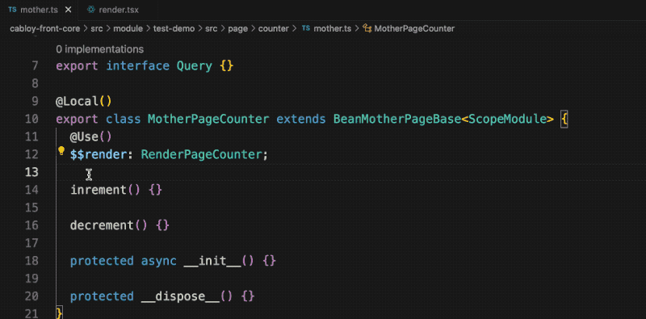

# zova-ui-element

zova-ui-element is a vue3 framework with ioc container. With the support of ioc container, defining reactive states no longer needs `ref/reactive`, nor `ref.value`

[![LICENSE MIT][license-image]][license-url]
[![NPM version][npm-image]][npm-url]
[![NPM download][download-image]][download-url]

[license-image]: https://img.shields.io/badge/license-MIT-blue.svg
[license-url]: https://github.com/cabloy/zova/blob/master/LICENSE
[npm-image]: https://img.shields.io/npm/v/zova-ui-element.svg?style=flat-square
[npm-url]: https://npmjs.com/package/zova-ui-element
[download-image]: https://img.shields.io/npm/dm/zova-ui-element?color=orange&label=npm%20downloads
[download-url]: https://npmjs.com/package/zova-ui-element

## Documentation

- [Get Started](https://zova.js.org/guide/start/introduction.html)
- [Why Vue3+IOC?](https://zova.js.org/guide/start/why.html)

## Features

zova-ui-element has introduced the following distinct features for Vue3:

1. `No ref/reactive`, `No ref.value`: With the support of ioc container, defining reactive states no longer needs `ref/reactive`. Without `ref`, naturally there is no need to write a lot of `ref.value`
2. `Type programming without type`: Zova adopts a strategy that combines dependency injection and dependency lookup, significantly reducing the use of decorator functions. Prioritizing the use of dependency lookup can achieve a development experience of `Type programming without type`, which means that we can enjoy the many benefits of type programming without the need to annotate types, thus keeping our code concise and elegant, significantly improving development efficiency, and ensuring code quality
3. `Modularization`: In a large web business system, as the business grows and changes, it is also necessary to divide the system into relatively independent modules in order to avoid code bloating. This is why Zova introduces modularization. In Zova, a module is a natural bundle boundary, and automatically bundled into an independent asynchronous chunk when building, bidding farewell to the hassle of Vite configuration and effectively avoiding the fragmentation of bundles. Especially in large business systems, this advantage is particularly evident

## Gif demonstration



## Demonstration: no `ref/reactive`, no `ref.value`

### 1. Define reactive state

Define a reactive variable `count` in the component and add two methods to modify its value

```typescript
export class ControllerPageCounter {
  count: number = 0;

  increment() {
    this.count++;
  }

  decrement() {
    this.count--;
  }
}
```

### 2. Use reactive state

Use `count` in render class

```typescript
export class RenderPageCounter {
  render() {
    return (
      <div>
        <div>count(ref): {this.count}</div>
        <button onClick={() => this.increment()}>Increment</button>
        <button onClick={() => this.decrement()}>Decrement</button>
      </div>
    );
  }
}
```

## Demonstration: dependency injection

### 1. Logic Reuse

Create a `Counter` Bean to implement the logic of `count`

```typescript
@Local()
export class Counter {
  count: number = 0;

  increment() {
    this.count++;
  }

  decrement() {
    this.count--;
  }
}
```

### 2. Inject and use in a component

```typescript
export class ControllerPageCounter {
  @Use()
  $$counter: Counter;
}
```

```typescript
export class RenderPageCounter {
  render() {
    return (
      <div>
        <div>count(ref): {this.$$counter.count}</div>
        <button onClick={() => this.$$counter.increment()}>Increment</button>
        <button onClick={() => this.$$counter.decrement()}>Decrement</button>
      </div>
    );
  }
}
```

## Stay In Touch

- [Twitter](https://twitter.com/zhennann2024)
- [Wechat](../zova-docs/zh/assets/img/wx-zhennann.jpg)

## License

[MIT](./LICENSE)

Copyright (c) 2016-present, Zova
